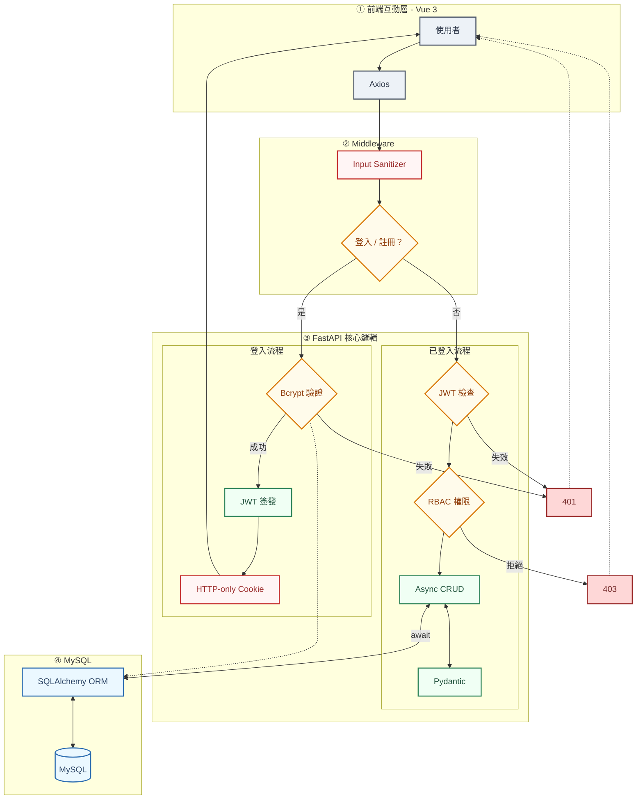
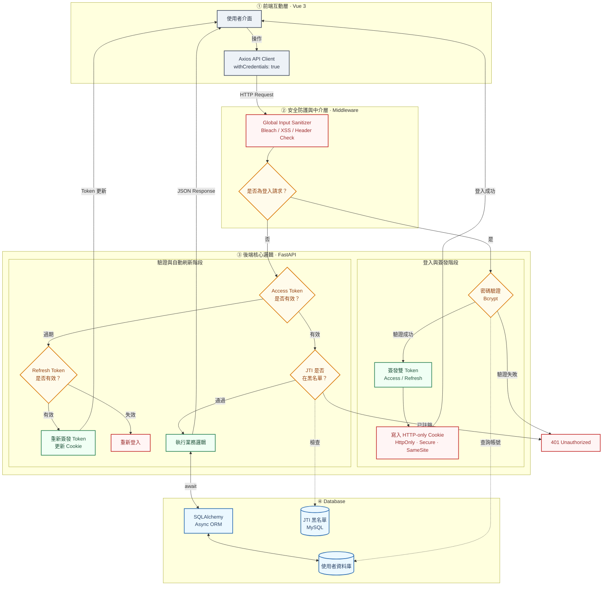
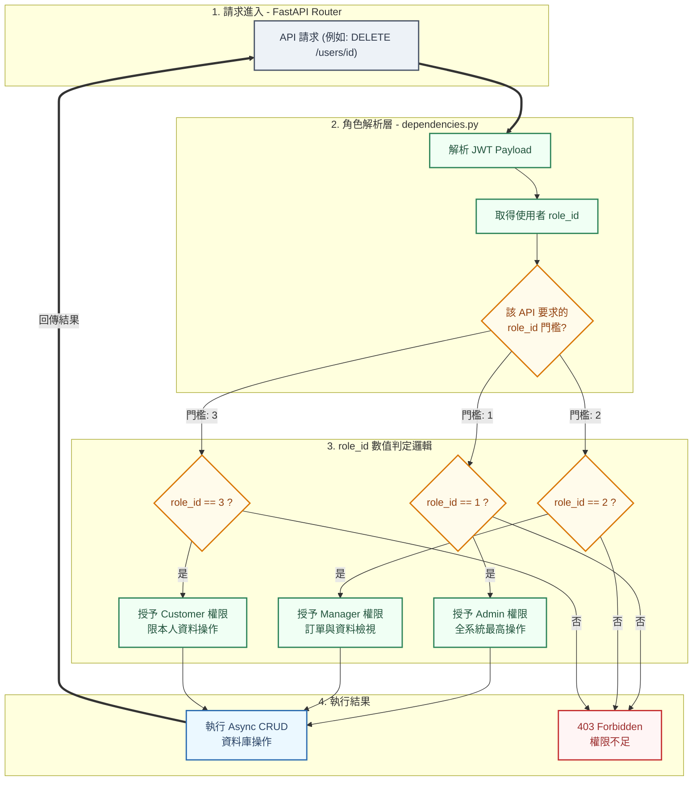
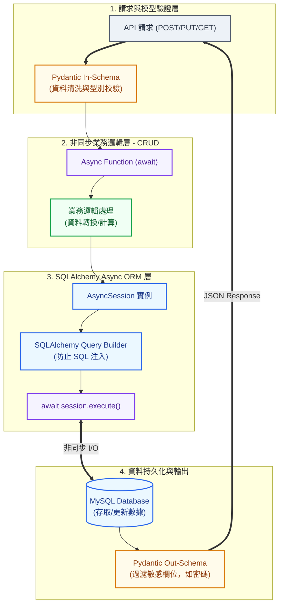
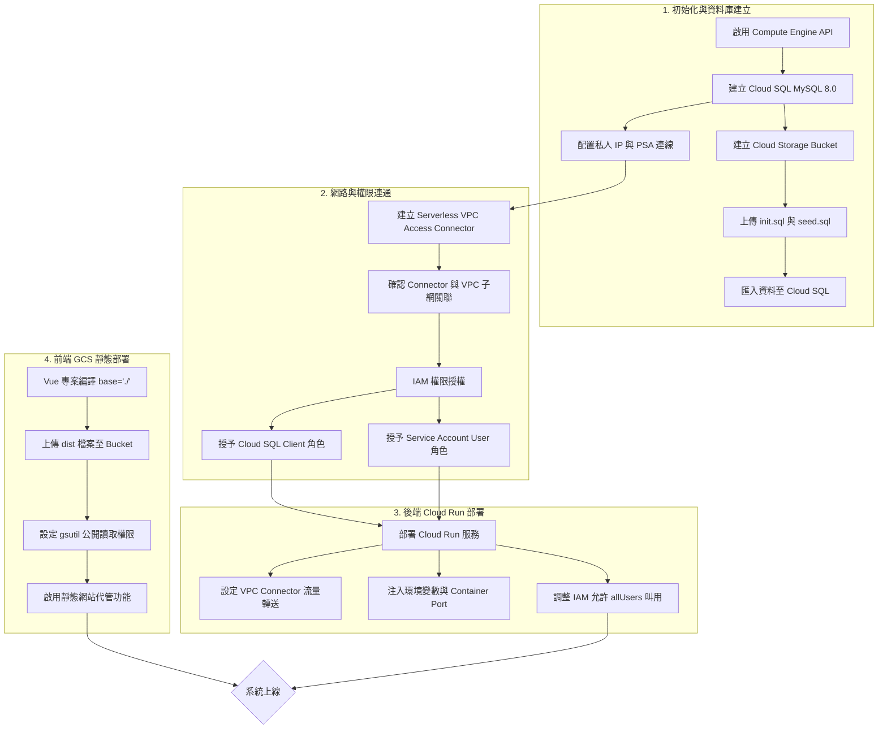

#  會員後台管理系統（Member Order Management System）

##  專案簡介
本專案是一個採用 **FastAPI + Vue 3 + MySQL** 為核心的**前後端分離**後台管理系統，旨在提供安全、高效、且易於部署的管理介面。系統實現了從基礎會員功能到複雜角色權限控制的完整後台服務。

---

##  核心技術棧 (Technology Stack)

| 領域 | 技術 / 框架 | 亮點說明 |
|------|---------------|-----------|
| **後端 (Backend)** | $\text{FastAPI}$ + $\text{Pydantic}$ | 高性能 Python 框架，結合 Pydantic 實現高效的資料模型與驗證。 |
| **資料庫 (Database)** | $\text{MySQL}$ | 穩定的關聯式資料庫。 |
| **ORM** | $\text{SQLAlchemy (Async ORM)}$ | 採用非同步 ORM 模式，提升資料庫 $\text{I/O}$ 效率。 |
| **前端 (Frontend)** | $\text{Vue 3}$ + $\text{Vite}$ | 採用 Vue 3 Composition API 搭配 Vite 快速開發和打包。 |
| **部署 (Deployment)** | $\text{Docker}$ / $\text{Docker Compose}$ | 容器化部署，確保開發與生產環境一致。 |
| **雲端 (Cloud)** | $\text{GCP}$ ( $\text{Cloud Run}$) | 支援伺服器部署與資料庫遷移的雲端延伸性。 |

---

##  核心特色 (Core Features)

本專案不僅提供完整的管理功能，更以 **安全性與架構設計** 為核心。

---

###  A. 系統功能完整

- **會員流程**：包含會員註冊、登入、登出。
- **基礎 CRUD 功能**：提供會員、商品、訂單的新增、查詢、修改、刪除功能。
- **精細化授權**：實作角色權限控管 ($\text{RBAC}$) 架構，確保用戶僅能存取其權限範圍內的資源。

---

###  B. 安全與驗證機制

- **雙 Token 撤銷機制**：採用短效期 $\text{Access Token}$ 與長效期 $\text{Refresh Token}$ 雙層防護。
- **即時黑名單 ($\text{JTI Blacklisting}$)**：確保使用者登出時， $\text{Access Token}$ 立即失效，防止被盜用。
- **前端安全防護**：透過 $\text{HTTP-only Cookie}$ 傳輸 Token，防禦 $\text{XSS}$ 惡意腳本竊取憑證。
- **輸入與密碼安全**：
  - 使用 $\text{bcrypt}$ 雜湊儲存密碼，強化資料安全。
  - 實作輸入淨化 ($\text{Sanitization}$)，使用 Python 的 $\text{bleach}$ 函式庫移除 $\text{HTML}$ 標籤以防禦 $\text{XSS}$。
- **API 層防護**：
  - 部署 $\text{CSP}$ 中介軟體以限制可載入資源。
  - 透過 $\text{SQLAlchemy ORM}$ 的參數化查詢防禦 $\text{SQL}$ 注入攻擊。

---

###  C. 架構與部署優勢

- **容器化設計**：完整的 $\text{Docker}$ 與 $\text{Docker Compose}$ 配置，確保環境一致與快速部署。
- **非同步高效能**：利用 $\text{FastAPI}$ 的非同步特性與 $\text{SQLAlchemy Async ORM}$，提升系統整體 I/O 效能。

---

##  系統運作流程 (How It Works)

### 1️ 登入與驗證流程
1.  使用者輸入帳密，前端呼叫 `/auth/login` $\text{API}$。
2.  後端使用 $\text{bcrypt}$ 驗證雜湊密碼。
3.  驗證成功後，生成 $\text{JWT Token}$（含使用者 $\text{ID}$、角色等 $\text{payload}$）。
4.  $\text{Token}$ 寫入 **$\text{HTTP-only Cookie}$** 返回給前端，防止 $\text{XSS}$ 竊取。
5.  後續請求中，後端中介層自動從 $\text{Cookie}$ 讀取 $\text{Token}$ 驗證身份。

### 2️ 權限驗證流程 ($\text{RBAC}$)
1.  所有重要 $\text{API}$ 端點皆透過 $\text{FastAPI}$ 的**依賴注入 $(\text{dependencies.py})$** 設定最低角色需求。
2.  權限檢查函式解析 $\text{Token}$ 中的角色資訊。
3.  若權限不足，立即返回 `HTTP 403 Forbidden`；若權限足夠，則執行業務邏輯。

### 3️ 資料存取流程
1.  $\text{API}$ 層呼叫對應的 **$\text{CRUD}$ 模組**。
2.  $\text{CRUD}$ 模組使用 **$\text{SQLAlchemy (Async)}$** 執行參數化查詢，安全地操作 $\text{MySQL}$ 資料庫。
3.  數據驗證與轉換： $\text{CRUD}$ 結果經由 $\text{Pydantic Schema}$ 進行嚴格的資料驗證，並轉換為標準化 $\text{JSON}$ 回傳前端。

---

## 系統運作流程 (How It Works)
###  系統架構總覽


###  身份驗證與安全防護流程 (Authentication & Security)


### RBAC 權限校驗流程 (Authorization)


### 資料存取流程 (Data Flow)

---

---

##  雲端部署架構 (Cloud Deployment Architecture)

本專案採用 **GCP (Google Cloud Platform)** 進行雲端部署，透過容器化與雲端部署確保系統的可用性與安全性。

###  部署流程圖



###  部署組件說明

#### 🔹 前端部署 (Frontend - Vue 3)
* **平台：** Google Cloud Storage (GCS)
* **策略：** **靜態網站代管 (Static Website Hosting)**
* **說明：** * 透過 `npm run build` 產生dist檔案並上傳至 GCS Bucket。
    * 設定 Bucket 為公開讀取，並配置 `index.html` 為入口點（SPA 支援）。

#### 🔹 後端部署 (Backend - FastAPI)
* **平台：** Google Cloud Run
* **策略：** **容器化部署 (Docker)**
* **說明：** * **Dockerfile 驅動：** 直接讀取 GitHub 儲存庫中的 `Dockerfile` 進行映像檔構建，確保部署環境與開發環境高度一致。
    * **VPC Connector：** 建立 **Serverless VPC Access**，讓 Cloud Run 能透過內部私人 IP 安全存取資料庫，避免暴露於公開網路。
    * **Auto-scaling：** 根據流量自動調整實體數量，實現高效能與成本優化。

#### 🔹 資料庫部署 (Database - MySQL)
* **平台：** Google Cloud SQL
* **策略：** **代管式關聯資料庫 (Managed MySQL)**
* **說明：** * 使用 MySQL 8.0 實體。
    * **網路安全性：** 僅開啟 **Private IP**，確保資料庫不會暴露於公網。
    * **初始化：** 透過 Cloud Storage 儲存槽自動匯入 `init.sql` 與 `seed.sql`，完成資料表結構與管理員帳號 (Admin) 的初始設定。

---


##  專案結構與檔案說明
```
Member-order-management-system/
├── backend/                          # 後端主程式
│   ├── app/
│   │   ├── api/                      # API 路由
│   │   │   ├── auth.py               # 會員 API（註冊、登入、管理）
│   │   │   ├── order_items.py        # 訂單項目 API
│   │   │   ├── orders.py             # 訂單管理 API
│   │   │   ├── products.py           # 商品 API
│   │   │   └── users.py              # 使用者管理 API
│   │   │
│   │   ├── core/                     # 核心設定模組
│   │   │   ├── config.py             # 環境變數與設定
│   │   │   ├── csp_middleware.py     # CSP 中介軟體
│   │   │   ├── jwt.py                # JWT 驗證與簽發
│   │   │   ├── sanitizer.py          # 輸入清理與防 XSS
│   │   │   └── security.py           # 密碼加密與驗證
│   │   │
│   │   ├── crud/                     # 資料庫操作層
│   │   │   ├── order_items.py
│   │   │   ├── orders.py
│   │   │   ├── products.py
│   │   │   └── users.py
│   │   │
│   │   ├── models/                   # ORM 模型
│   │   │   ├── base.py
│   │   │   ├── jwt_blacklist.py
│   │   │   ├── order_items.py
│   │   │   ├── orders.py
│   │   │   ├── products.py
│   │   │   ├── refresh_token.py
│   │   │   ├── roles.py
│   │   │   ├── used_jwt.py
│   │   │   └── users.py
│   │   │
│   │   ├── schemas/            # Pydantic定義驗證API請求與回傳的資料結構
│   │   │   ├── order_items.py
│   │   │   ├── orders.py
│   │   │   ├── products.py
│   │   │   ├── roles.py
│   │   │   └── users.py
│   │   │
│   │   ├── dependencies.py           # 依賴與權限判斷
│   │   └── main.py                   # FastAPI 進入點
│   │
│   ├── tests/                        # 單元測試
│   │   ├── test_auth.py
│   │   └── test_security.py
│   │
│   ├── Dockerfile                    # 後端 Docker 設定
│   └── requirements.txt              # 依賴套件列表
│
├── database/                         # 資料庫初始化 SQL
│   ├── init.sql                      # 建表指令
│   └── seed.sql                      # 預設資料（如角色admin）
│
├── frontend/                         # 前端專案
│   ├── src/
│   │   ├── components/               # 可重用元件
│   │   ├── views/                    # 頁面
│   │   │   ├── Home.vue
│   │   │   ├── Dashboard.vue
│   │   │   ├── Login.vue
│   │   │   ├── Orders.vue
│   │   │   ├── Products.vue
│   │   │   ├── Register.vue
│   │   │   └── Users.vue
│   │   ├── App.vue
│   │   ├── api.js                    # 後端 API 串接設定
│   │   ├── router.js                 # Vue Router 設定
│   │   ├── main.js                   # Vue 入口
│   │   └── style.css                 # 全域樣式
│   │
│   ├── .dockerignor
│   ├── .gitignore
│   ├── index.html
│   ├── nginx.conf
│   ├── package-lock.json
│   ├── Dockerfile                    # 前端 Docker 設定
│   ├── package.json
│   └── vite.config.js
├── docker-compose.yml
├── README.md
└── .gitignore
```
---

## 角色導向存取控制 ($\text{RBAC}$) 定義

$\text{RBAC}$ 採用「角色綁定權限」方式，方便後期擴充。

| 角色 | 可執行操作 | 權限範圍 |
| :--- | :--- | :--- |
| **Admin** | 新增/刪除/修改/查詢所有使用者與訂單 | 全系統最高權限 |
| **Manager** | 查詢與管理所有訂單，檢視使用者資料 | 管理層權限 |
| **Customer** | 查詢、編輯個人訂單與個人資料 | 限本人資料 |

---


## 專案未來規劃 (Roadmap)

本專案持續優化性能與擴展功能。

以下為我們正在規劃或計劃納入的未來開發目標。

---

###  核心功能與使用者體驗

| 項目 | 詳細說明 | 目標價值 |
| --- | --- | --- |
| **1. 使用者前台介面** | 完成獨立的客戶購物前台應用程式，並與現有的後端 `API` 進行完整串接。 | 提供完整的 B2C 購物流程體驗。 |
| **2. 開放式瀏覽 API** | 實作專門的公開 `API` 端點，允許未註冊使用者（訪客）瀏覽商品列表和詳情。 | 提升商品曝光率與可訪問性。 |
| **3. Cloud Storage 整合** | 結合雲端儲存服務（`Google Cloud Storage`），讓賣家可以直接上傳和管理商品圖片。 | 提高圖片載入效率，減輕伺服器負載。 |
| **4. 商品庫存同步** | 實作嚴謹的庫存管理機制，在訂單成立時自動扣減庫存，並在取消或退貨時回補。 | 確保庫存數據的即時性與準確性。 |
| **5. 後臺統計儀表板** | 建立數據視覺化儀表板，提供關鍵指標（如銷售額、熱門商品、用戶行為）的圖表分析。 | 輔助管理員進行商業決策。 |

---

###  品質、性能與自動化

| 項目 | 詳細說明 | 目標價值 |
|------|-----------|-----------|
| **6. CI/CD 自動化** | 建立 `GitHub Actions` 工作流，實現程式碼合併後的自動測試、建置 `Docker` 映像檔和自動部署。 | 提升開發效率、縮短交付週期、保證部署品質。 |
| **7. Log / 錯誤追蹤** | 整合錯誤監控服務，以便即時追蹤、診斷環境中的運行錯誤。 | 快速定位問題，提升系統穩定性和維護效率。 |

---